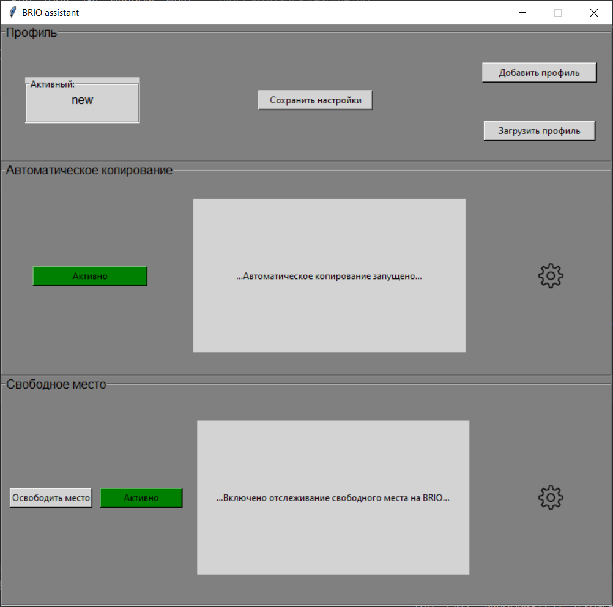

<h1 align="center">
    BRIO assistant
</h1>

<h2>Описание</h2>
Эта программа разработана для автоматизации работы с файлами сервера записи видео на windows (может 
использоваться для работы с разными типами файлов). Разработка велась под конкретные условия, из-за чего названия папок-источников (BRIO) и структура целевых папок (ORIGINAL) фиксированы. Программа выполняет две функции:    
 * Автоматическое копирование файлов в целевые папки и размещение по датам, используя созданные правила и фильтры. 
 * Отслеживает свободное место на диске и уведомляет о достижении указанного минимального значения. Позволяет запустить настраиваемую очистку диска. 

Также имеется блок управления профилями, позволяющий каждому пользователю сохранять персональные настройки.
 Логирование событий и ошибок  производится в папку _log_.

 

<h2>Использование</h2>
Перед запуском файла _BRIO_assistant.exe_, указываем в файле _config.ini_ суффикс (определяет расширение отслеживаемых файлов),
а также папки-источники и целевые папки (там же можно изменить дополнительные настройки).
После загрузки интерфейса программы создаем и загружаем новый профиль, после чего в настройках "автокопирования" и "свободного места" (колесико)
указываем желаемые настройки.  "Установить значения" для текущей сессии и "Сохранить настройки" для профиля.
 Добавляем фильтры (ключевые слова в названии файла) по которым программа копирует файл в определенную папку.  В целевой папке файл появляется с именем "Файл копируется..._имя_файла_", после завершения копирования переименовывается по исходному файлу.

<h2>Используемые библиотеки</h2>

Для создания графического интерфейса использовался tkinter
 Остальные: configparser, logging, queue, threading, locale, psutil, pythoncom, win32com.shell.